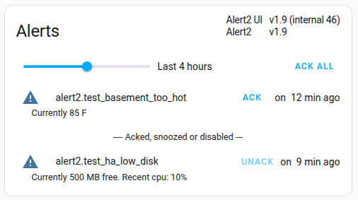
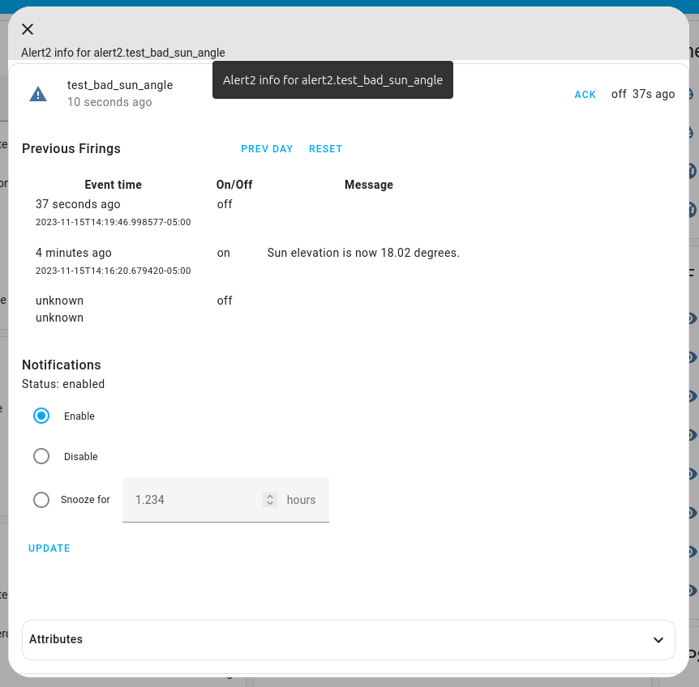

<!-- ~/tmp/general-env/bin/grip -b ~/home-monitoring/homeassistant/custom_components/alert2/README.md -->

# Alert2

Alert2 is a [Home Assistant](https://www.home-assistant.io/) component that supports alerting and sending notifications based on conditions and events. It's a retake on the original [Alert](https://www.home-assistant.io/integrations/alert/) integration.

## Table of Contents

- [New features](#new-features)
- [Installation](#installation)
- [Description](#description)
- [Configuration](#configuration)
- [Front-end UI](#front-end-ui)
- [Service calls](#service-calls)
- [Python alerting](#python-alerting)


## New features

- **Native event-based alerting**. No need to approximate it with conditions and time windows.
- **Template conditions**.  No need for extra binary sensors. Also means the logic for an alert is in one place in your config file, which makes it easier to manage.
- **Snooze / disable notifications**. Handy for alerts that fire frequently. Example: a temperature sensor that hovers right around a threshold.
- **Persistent notification details**. In your HA dashboard, you can view past alert firings as well as the message text sent in notifications.
- **Custom frontend card**. Makes it easier to view and manage recent alerts.

## Installation

TODO - Support installation via HACS

### Manual 

Alert2 is not yet a bundled component in HomeAssistant, so installation requires a few more steps than otherwise.

1. Create the directories `custom_components` and `www` in your Home Assistant configuration directory if they don't already exist.

   Your configuration directory is something like 'config' share if using [hass.io](https://home-assistant.io/hassio/) with the [Samba](https://home-assistant.io/addons/samba/) add-on or typically `~/.home-assistant/` for Linux installations.
1. Copy `alert2` and its contents from the `custom_components` directory in this project into the directory `custom_components`.
1. Copy `alert2.js` from the `www` directory in this project into the directory `www`.

   Your config directory should look similar to this after copying:
   
        <config dir>/configuration.yaml
        <config dir>/www/alert2.js
        <config dir>/custom_components/alert2/__init__.py
        <config dir>/custom_components/alert2/sensor.py
         ... etc...


1. Add the following line to your `configuration.yaml` file:

        alert2:

    The [Configuration](#configuration) section, below, has details on what else to add here.

    Also, add the two lines in bold to the `resources` section of the lovelace section:

    <pre>lovelace:
      resources:
        <b>- url: /local/alert2.js</b>
          <b>type: module</b></pre>
1. Restart HomeAssistant

## Description

Alert2 supports two kinds of alerts:

- **Condition-based alerts**. The alert watches a specified (template) condition. It is "firing", aka "on", while the condition evaluates to true. This is similar to the existing [Alert](https://www.home-assistant.io/integrations/alert/) integration. Example: a temperature sensor that reports a high temperature.
- **Event-based alerts**. The alert waits for a specified trigger to occur and is "firing" for just that moment.  Example: a problematic MQTT message arrives.

Each alert can specify a template message that is evaluated each time the alert fires. That message is sent out with notifications and also is viewable in the front-end UI.

Each alert maintains a bit indicating whether it has been ack'd or not.  That bit is reset each time the alert fires. Ack'ing is done by clicking a button in the UI (described below). Ack'ing stops reminder notifications (see below) and is indicated visually in the UI.


### Notifications

Each time an alert fires, a notification can be sent. Notifications can also be sent periodically to remind you of previous alert firings.

There are a few mechanisms available for controlling when a notification is sent.

* `notification_frequency_mins` - this config parameter specifies how often notifications or reminders are sent for a specific alert. It applies to single or multiple firings. So whether an alert is firing continuously for a long time or fires many times, notification frequency does not exceed this parameter.  The parameter also controls how often reminder notifications are sent.

* Ack'ing an alert prevents any further notifications for the current firing (for condition alerts) or previous firings (for event alerts) of the alert.  Condition alerts cause notification reminders to be sent until the firing is ack'd. Ack'ing affects only the current firing of the alert, not future firings.

* Snoozing notifications for an alert prevents any notifications from current or future firings of an alert for a specified period of time.

* Disabling notifications for an alert prevents any notifications until it is enabled again.  Snoozing & disabling affect only notifications. Alerts will still fire and be recorded for reviewing in your dashboard.

The text of a notification can include a custom message with details. It also includes some basic information such as how long the alert has been firing (for condition alerts) as well as how many times it has fired since the last notification. Usually the notification text will be simple, like:

    Alert2 my_test_alert: turned off after 5m

meaning your condition alert stopped firing after being on for 5 minutes. For very active alerts, you may see text like:

    Alert2 my_test_alert +4x (most recently 20m ago): on for 20m

meaning your alert has fired four times since the last notification. Most recently it started firing 20 minutes ago and is still firing.

## Configuration

Alert configuration is done through the `alert2:` section of your `configuration.yaml` file.

### Defaults

A `defaults:` subsection specifies default values for parameters common to every alert. Each of these parameters must be specified either in this subsection, or on a per-alert basis.  Per-alert settings override any defaults.

| Key | Type | Description |
|---|---|---|
| `notification_frequency_mins` | float | Minimum frequency between notifications of alert firings. Also is the frequency of reminders for ongoing, un-ack'd condition alerts.<br>TODO - allow this be a template argument to support arbitrary functions calculating next notification delay. |
| `notifier` | string | Name of notifier to use for sending notifications. Notifiers are declared with the [Notify](https://www.home-assistant.io/integrations/notify/) integration |

Example:

    alert2:
      defaults:
        notification_frequency_mins: 60
        notifier: telegram

### Each Alert

The `alerts:` subsection is where you declare condition-base and event-based alerts.  The parameters are as follows:

| Key | Type | Description |
|---|---|---|
| `domain` | string | part of the entity name of the alert. The entity name of an alert is `alert2.{domain}_{name}`. `domain` is typically the object causing the alert (e.g., garage door) |
| `name` | string | part of the entity name of the alert. The entity name of an alert is `alert2.{domain}_{name}`. `name` is typically the particular fault occurring (e.g., open_too_long) |
| `condition` | string | Template string that evaluates to truthy when the alert is firing. |
| `trigger` | object | A [trigger](https://www.home-assistant.io/docs/automation/trigger/) spec. If present, the alert is an event-based alert. The alert is considered to have fired when the trigger is triggered AND when the condition is truthy. |
| `message` | string | template string evaluated when the alert fires. This text is included in notifications. Can be the empty string (`""`). For event-based alerts, the message can reference the `trigger` variable.

All parameters are required, except `condition` and `trigger`, which should have only one defined. The reason that alert names are split into `domain` and `name` is partly for semantic clarity and also for future management features, like grouping alerts by domain.

An example of alert definitions:

    alert2:
      defaults:
        notification_frequency_mins: 60
        notifier: telegram
      alerts:
        - domain: garage_door
          name: open_too_long
          condition: "{{ (now().timestamp() - states.sensor.garage_door_open_status.last_changed.timestamp()) | int > 500 }}"
          message: "Door open since {{ as_local(states.sensor.garage_door_open_status.last_changed) }}"

        - domain: boiler
          name: ignition_failed
          trigger:
           - platform: state
             entity_id: sensor.boiler_failed_ignition_count
          condition: "{{ (trigger.from_state is not none) and (trigger.to_state is not none) and (trigger.from_state.state|int(-1) > 0) and (trigger.to_state.state|int(-1) > 0) and (trigger.to_state.state|int > trigger.from_state.state|int) }}"
          message: "{{ trigger.from_state.state }} -> {{ trigger.to_state.state }}"

### Service-triggered alerts

Event-based alerts can also be triggered by a hass service call (described below). It is useful to declare these alert names in the config file for two reasons. First, to avoid an extra alert firing that indicates an undeclared alert has fired. And second, so that the alert state can be recovered when HomeAssistant starts.

The `tracked` subsection is where to declare these alerts. The only parameters allowed for each alert in this alert list are the `domain` and `name` keys defined above.

Example:

    alert2:
      defaults:
        notification_frequency_mins: 60
        notifier: telegram
      alerts:
        ...
      tracked:
        - domain: dahua
          name: front_porch_fault
        - domain: dahua
          name: side_porch_fault


## Front-end UI

### Alert overview

alert2.js, which you installed earlier, defines a custom UI card called `alert2-overview`. If you are using the yaml config for lovelace, you can add this card to your dashboard by adding it to the list of cards in a view, like (in bold):

<pre>views:
- title: Monitoring
  name: Example
  cards:
  <b>- type: "custom:alert2-overview"</b>
  - type: entities
    ...</pre>

The card lists recently active alerts, as well as snoozed or disabled alerts.  A slider at the top of the card controls the time window covered. Each line shows the status of the alert, including when it last fired, how many times it fired since the last notification, and whether it has been ack'ed, snoozed or disabled.  Each alert will show an "ACK" button if it hasn't been acked already. The button "ACK ALL" will ack all alerts, not just the ones displayed.



### Detailed alert info

If you click on a specific alert listed in the alert overview, a dialog pops up with detailed info on the alert and notification controls. Example:



The first line is a repeat of the alert status.

The second "Previous Firings" section lists each firing over the previous 24 hours.  The time when the alert turned on or off is listed as well as the message template text corresponding to the firing.  The "PREV DAY" button lets you look at firings one day earlier and "RESET" returns the listing to the firings over the past 24 hours.  You may see events listed that have time `unknown`. This are extra events inserted due to either HomeAssistant restarting or the first time an alert is created (TODO - filter these spurious events out).

The "Notifications" section lets you snooze or disable notifications. Select an option and click "Update".

### Other ways to view alerts

You may also add alert2 entities to entities cards and other cards that support entities.  If you click on an alert shown in such a situation, you'll see a popup (called a "more-info dialog") similar to the one shown above.  However, since Alert2 isn't integrated into the core HomeAssistant, that dialog will include some extra default sections like "history", but will also include the sections described above.


## Service calls

Alert2 defines a few new service calls.

`alert2.report` notifies the system that an event-based alert has fired. It takes two parameters, the "domain" and "name" of the alert that fired.  You can also pass an optional `message` argument specifying a template for a message to include with the firing notification. That domain/name should be declared in the `tracked` section of your config (described above).

An example of using alert2.report in the action section of an automation:

        trigger:
          ...
        condition:
          ...
        action:
          - service: alert2.report
            data:
              domain: "boiler"
              name: "fault_{{trigger.event.data.name}}"
              message: "code is {{ trigger.event.data.dData.Code }}"

A few other service calls are used internally by alert2.js, but are available as well:

`alert2.ack_all` acks all alerts.
<br>`alert2.notification_control` adjust the notification settings.
<br>`alert2.ack` acks a single alert.

More details on these calls are in the `services.yaml` file in this repo.

## Python alerting

If you're developing python components, Alert2 is handy for alerting on unexpected conditions. The way to do that is:

1. In your component, import `alert2` and in `async_setup` declare whatever event alerts you might want to trigger. E.g.:

        import custom_components.alert2 as alert2

        async def async_setup(hass, config):
            await alert2.declareEventMulti([
                { 'domain': DOMAIN, 'name': 'some err 1' },
                { 'domain': DOMAIN, 'name': 'some err 2' },
                ...
            ])

1. To trigger an alert, call report(), which takes an optional message argument. E.g.:

        if unexpected_thing_happens:
            alert2.report(DOMAIN, 'some err 1', 'optional message string')

The `alert2` module also offers a `create_task()` method to create tasks. It's similar to `hass.async_create_task` except it also `report()`s uncaught exceptions - so your task doesn't die silently.  Example usage:

```
async def testTask():
    pass
taskHandle = alert2.createTask(hass, DOMAIN, testTask())
#
# Later on, cancel task if you want
taskHandle.cancel()
```
If an unhandled exception occurs, alert2 will fire an alert: `alert2.{DOMAIN}_unhandled_exception`.  `declareEventMulti()` automatically declares `{DOMAIN}_unhandled_exception` if you haven't already.
