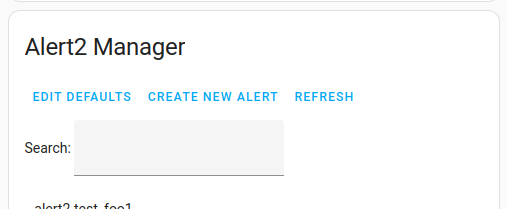

<!-- ~/tmp/general-env/bin/grip -b ~/tmp/hass-alert2/README.md
To spin up a fresh HA for testing:
mkdir -p ha-test/custom_components/hacs
wget https://github.com/hacs/integration/releases/latest/download/hacs.zip
unzip hacs.zip -d ha-test/custom_components/hacs  ; rm hacs.zip
cp .homeassistant/run ha-test/run
chgrp -R homeassistant ha-test ; chmod -R g+w ha-test
cp ha-test.old/configuration.yaml ha-test
# comment out lovelace stuff
# restart home assistant
# install HACS as integration
# test install alert2
# can copy over fresh files with:
#    cp .homeassistant/custom_components/alert2/* ha-test/custom_components/alert2/
#    cp .homeassistant/www/alert2.js ha-test/www/community/hass-alert2-ui/
#    gzip -c ha-test/www/community/hass-alert2-ui/alert2.js > ha-test/www/community/hass-alert2-ui/alert2.js.gz
-->

[](https://github.com/redstone99/hass-alert2/releases)
[](https://github.com/redstone99/hass-alert2/releases)
[](https://github.com/redstone99/hass-alert2/commits/master/)
<!--  -->

# Alert2

Alert2 is a [Home Assistant](https://www.home-assistant.io/) component that supports alerting and sending notifications based on conditions and events. It's a retake on the original [Alert](https://www.home-assistant.io/integrations/alert/) integration.


## Table of Contents

- [New features](#new-features)
- [Installation](#installation)
- [Setup](#setup)
- [Description](#description)
- [Configuration](#configuration)
- [Generator patterns](#generator-patterns)
- [Front-end UI](#front-end-ui)
- [Service calls and events](#service-calls-and-events)
- [Python alerting](#python-alerting)
- [Contributing](#contributing)


## New features

- **Native event-based alerting**. No need to approximate it with conditions and time windows.
- **Expressive condition-based alerts**
   - **Templates**.  No need for extra binary sensors. Also means the logic for an alert is in one place in your config file, which makes it easier to manage.
   - **Split on/off**.  Separately specify how a condition alert turns on & off.
- **Notification control**
   - **Snooze / disable / throttle notifications**. Handy for noisy sensors or while developing your alerts.
   - **Template notifiers**. Dynamically specify who gets notified.
   - **Superseding alerts**. Stage alerts to avoid redundant notifications from related alerts.
   - **Persistent notification details**. In your HA dashboard, you can view past alert firings as well as the message text sent in notifications.
- **Generator patterns**. Dynamically define multiple similar alerts, with wildcard support.
- **UI**
   - Create or edit alerts via the UI. Also reload YAML without restarting HA.
   - Overview card showing recently active alerts, prioritized, and custom, dynamic messages.
- **Hysteresis**. Reduce spurious alerts as sensors fluctuate.

Suggestions welcome! Start a [Discussion](https://github.com/redstone99/hass-alert2/discussions) or file an [Issue](https://github.com/redstone99/hass-alert2/issues).  Or follow the [development thread](https://community.home-assistant.io/t/alert2-a-new-alerting-component).


## Installation

<details>
<summary>HACS install (recommended)</summary>

1. If HACS is not installed, follow HACS installation and configuration instructions at https://hacs.xyz/.

1. Click the button below

    [](https://my.home-assistant.io/redirect/hacs_repository/?owner=redstone99&repository=hass-alert2&category=integration)

    or visit the HACS pane, type **Alert2** in the search field, expand "New" or "Available for download" if necessary, and click on **Alert2** to get to the details page.

    If, for some reason, Alert2 does not show up as a HACS search result, you can add Alert2 manually by adding `https://github.com/redstone99/hass-alert2.git` as a custom repository of type `Integration` by following [these instructions](https://hacs.xyz/docs/faq/custom_repositories/).

1. The UI should now show the Alert2 doc page in HACS. Click "Download" button (bottom right of screen) to download the Alert2 integration.

    If for some reason adding the repository did not take you to the Alert2 doc page, you may need to click again on the HACS pane, search for "Alert2" and click on it to get to the page (and the download button).

1. We strongly recommend also installing the [Alert2 UI](https://github.com/redstone99/hass-alert2-ui) card which is a compact way to view and manage Alert2 alerts.

</details>
<details>
<summary>Manual install</summary>

1. Download the `Source code (zip)` link from the repository [release section](https://github.com/redstone99/hass-alert2/releases) under "Assets" and extract it.

   We do not recommend downloading directly from the `master` branch.

1. Create the directory `custom_components` in your Home Assistant configuration directory if it doesn't already exist.

   Your configuration directory is the directory with `configuration.yaml`. It is commonly `/config`, or may be something like `~/.home-assistant/` for Linux installations.
   
1. Copy the `alert2` folder inside the `custom_components` directory in the `Source code` link you downloaded into the directory `custom_components` in your config.

   Your config directory should look similar to this after copying:
   
        <config dir>/configuration.yaml
        <config dir>/custom_components/alert2/__init__.py
        <config dir>/custom_components/alert2/sensor.py
         ... etc...

1. We strongly recommend also installing the [Alert2 UI](https://github.com/redstone99/hass-alert2-ui) card which is a compact way to view and manage Alert2 alerts.

</details>

## Setup

Alert2 can be set up and managed either via the UI, via your `configuration.yaml` file, or both.

<details>
<summary>Setup via the UI</summary>

1. Go to Settings -> "Devices & Services" , then click on the "+ Add Integration" button

1. Search for and then click "Alert2", then "Finish"

1. Add the Alert2 Manager & Alert2 Overview cards from [Alert2 UI](https://github.com/redstone99/hass-alert2-ui).  You can created & edit alerts using the Manager card and view active alerts using the Overview card.

</details>

<details>
<summary>Setup via YAML</summary>

1. Add the following line to your `configuration.yaml`:

        alert2:

    The [Configuration](#configuration) section, below, has details on what else to add here.

1. Restart HomeAssistant

</details>

## Description

Alert2 supports two kinds of alerts:

- **Condition-based alerts**. The alert is "firing", aka "on", for a period of time, such as while a condition is true. This is similar to the existing [Alert](https://www.home-assistant.io/integrations/alert/) integration. Example: a temperature sensor that reports a high temperature.

- **Event-based alerts**. The alert is "firing" for just a moment, such as when a specified trigger occurs. Example: a problematic MQTT message arrives.

Configuration syntax and examples are in the [Configuration section]((#configuration)). Here is an overview:

### Condition alerts

Condition alerts can be specified in one of two modes:

1. **Standard**:  Condition alerts can specify a `condition` as a template or entity name. The alert turns on when the condition evaluates to true and turns off when the condition evaluates to false.

   The alert can also specify a `threshold` dict that includes min/max limits and optional hysteresis.  If a threshold is specified, the alert is firing if the threshold is exceeded AND any `condition` specified is true.

2. **Separate on/off**: Alternatively, the alert can specify separate criteria for turning on and off. A set of config fields: `trigger_on`, `condition_on` and `manual_on` offer options for when the alert will turn on. And a corresponding set of config fields: `trigger_off`, `condition_off` and `manual_off` determine when the alert will turn off.

For either condition alert mode, hysteresis is available via the `delay_on_secs` parameter. If specified, the alert starts firing once the "on" criteria have been satisfied for the time interval specified. This is similar in motivation to the `skip_first` option in the old Alert integration.

The `supersedes` parameter specifies a hierarchical relationship between related condition alerts. If an alert is firing, notifications will be skipped for other alerts below it in the hierarchy.  An example might be one alert if the front door is open, and another superseding alert if the door is open and it's cold outside.

### Event alerts

Event alerts may be triggered either by an explicit `trigger` option in the config, or by a service call to `alert2.report`.
An event alert can also specify a `condition` as a template or entity name. The alert fires if it is triggered AND the condition evaluates to true.

### Common alert features

Each alert maintains a bit indicating whether it has been ack'd or not.  That bit is reset each time the alert fires. Ack'ing is done by clicking a button in the UI (described below) or calling the `alert2.ack` service. Ack'ing stops reminder notifications (see below) and is indicated visually in the UI.  The `alert2.unack` service is also available.

Each alert can specify a priority. Priority affects how the alert is displayed in the Alert2 UI Overview card.

### Notifications

Notifications are sent when an event alert fires, when a condition alert starts or stops firing, and periodically as a reminder that a condition alert is still firing.  You can optionally request that notifications be sent at the end of periods when notifications where snoozed or throttled if there was any alert activity in the interval. This is via the `summary_notifier` config option.  We recommend setting `summary_notifier` to be notified when e.g., throttling ends.

Each notification by default includes some basic context information (detailed below).  An alert can also specify a template `message` to be sent  each time the alert fires. That message is sent out with notifications and also is viewable in the front-end UI.  Condition alerts can also specify a `done_message` to be sent when the alert stops firing, and a `reminder_message` to customize reminder notifications.

There are a few mechanisms available for controlling when and whether notifications are sent.

* `reminder_frequency_mins` - this config parameter specifies how often reminders are sent while an alert continues to fire. May be a list of values (similar to the `repeat` option in the old Alert integration).

* `throttle_fires_per_mins` - this config parameter throttles notifications for an alert that fires frequently. It affects all notifications for the alert.

* Ack'ing an alert prevents further reminders and the stop notification for the current firing of a condition alert. For both condition and event alerts, ack'ing also prevents any throttled notification of previous firings of the alert. Unack'ing an alert will restart notifications for a condition alert if it is still firing.

* Snoozing notifications for an alert implicitly acks the alert once and prevents any notifications from current or future firings of an alert for a specified period of time.

* Disabling notifications for an alert prevents any notifications until it is enabled again.  Snoozing & disabling affect only notifications. Alerts will still fire and be recorded for reviewing in your dashboard.


#### Notification text

The text of each notification by default includes some basic context information that varies based on the type of notification. That information may be augmented with the `message`, `done_message`, or `reminder_message` options.  Notification text looks like:

* Event alert fires: `message` text prepended with name (or `friendly_name`) of alert.

        Alert2 boiler_ignition_error: `message`

* Condition alert fires: `message` text prepended with name (or `friendly_name`) of alert.  Default message is "turned on" if no message specified. Alert name omitted if `annotate_messages` is false

        Alert2 kitchen_door_open: turned on

* Condition alert reminder that it's still on. This can be customized via `reminder_message`. Alert name omitted if `annotate_messages` is false.

        Alert2 kitchen_door_open: on for 5 m

* Condition alert stops firing: `done_message` text prepended with name (or `friendly_name`) of alert.  Default message is "turned off after ..." if no `done_message` specified. Only `done_message` text is sent if `annotate_messages` is false. Setting `annotate_messages` to false may be useful for notification platforms that parse the message (such as the "clear_notification" message of the `mobile_app` platform)

        Alert2 kitchen_door_open: turned off after 10 m

* Either event or condition alert fires and exceeds `throttle_fires_per_mins`.  Message is prepended with "[Throttling starts]", which can not be overridden with `annotate_messages`:

        [Throttling starts] Alert2 kitchen_door_open: turned on

* Throttling ends for event or condition alert that specified `throttle_fires_per_mins` and `summary_notifier` was specified.  Message includes information on what happened while the alert was throttled:

        [Throttling ends] Summary: Alert2 kitchen_door_open: fired 10x (most recently 15m ago): turned off 19s ago after being on for 3m

#### Notifiers

You can specify which notifiers are used for alerting via the `notifier`, `done_notifier`, and `summary_notifier` config options. They may be a single notifier, a list of notifiers, a template resolving to a list of notifiers, or the name of an entity whose state is a list of notifiers. See [Notifier Config](#notifier-config) section, below.

During HA startup, HA initializes notifiers independently of the rest of HA.  So notifiers may not be ready even when HA declares that it has fully started.  Alert2 will automatically defer notifications during startup if a notifier does not yet exist. `notifier_startup_grace_secs` controls the length of the startup grace period.


You may also specify a YAML [notify group](https://www.home-assistant.io/integrations/group/#notify-groups). We recommend setting `defer_startup_notifications` if you choose to use a notify group. The issue is that HA may initialize the notify group early during startup, before the member notifiers are ready. And Alert2 can not see which member notifiers are ready. So Alert2 may notify a group with missing members, resulting in an internal error in the notify component. To avoid this, you can list your group names in `defer_startup_notifications` which will defer any notifications to those notifiers until `notifier_startup_grace_secs` has passed.

The current recommended way to notify groups is to create an entity, such as a template entity (e.g. `sensor.high_pri_group`), and set the members of the group as the state of the entity (example in [Notifier Config](#notifier-config) section, below).  Alert2 will then automatically defer notifications to notifiers in the group that do not yet exist during startup, without having to set `defer_startup_notifications`.

Alert2 does not yet support [Notify Entity Groups](https://www.home-assistant.io/integrations/group/#notify-entity-groups), but open an [discussion](https://github.com/redstone99/hass-alert2/discussions) and request the feature if interested.

### Alert2 internal errors

Alert2 automatically defines a few event alerts that fire internally:

* `alert2.alert2_global_exception` - This event alert fires if an HA task crashes due to an unhandled exception. This includes tasks for components outside Alert2.  For this alert, `throttle_fires_per_mins` defaults to `[20,60]` to limit alerts if some component goes into a crash loop.

* `alert2.alert2_warning` - This event alert fires if the config contains something that is likely wrong but not an error (for example setting `clear_notification` without setting `annotate_messages` to false).  It fires at most once for each type of warning over the lifetime of your HA install.

* `alert2.alert2_error` - This event alert fires on config errors and errors in Alert2 itself. If you specify a notifier that doesn't exist for `alert2.error` itself, then it falls back to `persistent_notification`.

Each of these alerts can be configured in your config, either YAML or via the UI.  To disable notifications for an alert, you can set the notifier to `null`. See example in the [Tracked](#tracked) section, below.

If you want to completely disable these internal alerts, you can set `skip_internal_errors` to true. However, note that if `alert2.alert2_error` fires indicating a problem, you may stop receiving alerts for things you do care about. So in a sense, this alert is at least as important as your most important alert.

## Configuration

Alert configuration is done through the `alert2:` section of your `configuration.yaml` file.  There are three subsections: `defaults`, `alerts`, and  `tracked`.

We recommend that your config specify at least the following parameters:

```yaml
alert2:
  defaults:
    notifier: foo # notifier name to use for most alerts
    summary_notifier: foo # notifier to use for summaries (e.g. when throttling ends)
    throttle_fires_per_mins: [ 10, 60 ] # throttle notifications for any alert that fires
                                        # more than 10x in 60 minutes
```

Configuration may be reloaded on the fly by going to "Developer tools" -> "YAML" and clicking on "Alert2".  That deletes all alert2 alert entities and generators and then recreates them.  You can change defaults as well.  Reloading does not affect the startup-related config parameters `notifier_startup_grace_secs` and `defer_startup_notifications`.

### Top-level config options

The following are all optional.

| Key | Type | Description |
|---|---|---|
|`skip_internal_errors` | bool | If true, an entity for `alert2.error` will not be created, you will not receive any notifications for problems with your config file or Alert2 internal errors, and such errors won't show up in the Alert2 UI card.  Errors will still appear in the log file. Default is `false` |
| `notifier_startup_grace_secs` | float | Time to wait after HA starts for a notifier to be defined. See [Notifiers](#notifiers) section above for detailed explanation. Default is 30 seconds |
| `defer_startup_notifications` | bool or list | True means no notifications are sent until `notifier_startup_grace_secs` passes after startup. False means send notifications as soon as the notifier is defined in HA.  Or this parameter can be name of a single notifier or list of notifiers for those to defer during startup. Useful for notify groups. See [Notifiers](#notifiers) section above for more details |

Example:

     alert2:
       skip_internal_errors: true
       notifier_startup_grace_secs: 60
       defer_startup_notifications: mygroup
       defaults:
         ...

### Defaults

The `defaults:` subsection specifies optional default values for parameters common to every alert. Each of these parameters may be specified either in this subsection or over-ridden on a per-alert basis.

| Key | Type | Description |
|---|---|---|
| `reminder_frequency_mins` | float or list | Interval in minutes between reminders that a condition alert continues to fire. May be a list of floats in which case the delay between reminders follows successive values in the list. The last list value is used repeatedly when reached (i.e., it does not cycle like the `repeat` option of the old Alert integration).<br>Defaults to 60 minutes if not specified. Minimum is 0.01 min. |
| `notifier` | template | Name of notifiers to use for sending notifications. Notifiers are declared with the [Notify](https://www.home-assistant.io/integrations/notify/) integration. Service called will be `"notify." + notifier`.<br>Defaults to `persistent_notification` (shows up in the UI under "Notifications"). Can be list of notifiers, an entity name whose state is a list of notifiers, a template that evaluates to either, or "null" to indicate no notification. See [Notifier Config](#notifier-config) section below for possibilities here.  |
| `summary_notifier` | bool or template | True to send summaries (see [Notifiers](#notifiers) section for detail) using the same notifier as other notifications.  False to not send summaries.  Or can be a template similar to `notifier` parameter to specify notifier to use for summaries. Default is `false`. |
| `done_notifier` | bool or template | Controls notifier used to notify when a condition alert stops firing. True to use the `notifier` setting.  False or null to not send done notifications.  Or can be a template similar to `notifier` parameter to specify notifier to use for done notificaitons. Default is `true`. |
| `annotate_messages` | bool | If true, add extra context information to notifications, like number of times alert has fired since last notification, how long it has been on, etc. You may want to set this to false if you want to set done_message to "clear_notification" for the `mobile_app` notification platform.<br>Defaults to true. |
| `throttle_fires_per_mins` | [int, float] | Limit notifications of alert firings based on a list of two numbers [X, Y]. If the alert has fired and notified more than X times in the last Y minutes, then throttling turns on and no further notifications occur until the rate drops below the threshold. For example, "[10, 60]" means you'll receive no more than 10 notifications of the alert firing every hour.<br><br>Default is no throttling. You can set `summary_notifier` to be notified when throttling ends (by default you won't be). |
| `priority` | string | Can be "low", "medium", or "high". Affects display of alert in the Alert2 UI Overview card.  Active alerts are sorted by priority and medium and high-priority alerts have a badge colored orange and red, respectively. May be template when used with generators. Default is "low" |
| `supersede_debounce_secs` | float | Suppress notifications of an alert if any superseding alert has fired within this many seconds of now. The purpose of this setting is to reduce extraneous notifications due to races between two alerts both turning on or off at almost the same time. Defaults to 0.5 seconds.  Can be any value >= 0. |

Example:

     alert2:
       defaults:
         reminder_frequency_mins: 60
         notifier: telegram
         annotate_messages: true
         throttle_fires_per_mins: [ 10, 60 ]

Note `reminder_frequency_mins` or `throttle_fires_per_mins` may be specified as a list using a YAML flow sequence or on separate lines. The following two are identical in YAML:

        reminder_frequency_mins: [ 10, 20, 60 ]
        reminder_frequency_mins:
          - 10
          - 20
          - 60

### Alerts

The `alerts:` subsection contains a list of condition-based and event-based alert specifications. The full list of parameters for each alert are as follows:


| Key | Type | Required | Description |
|---|---|---|---|
|`domain` | string | required | part of the entity name of the alert. The entity name of an alert is `alert2.{domain}_{name}`. `domain` is typically the object causing the alert (e.g., garage door).<br>Can be a template when used with [generator patterns](#generator-patterns). |
| `name` | string | required | part of the entity name of the alert. The entity name of an alert is `alert2.{domain}_{name}`. `name` is typically the particular fault occurring (e.g., open_too_long).<br>Can be a template when used with [generator patterns](#generator-patterns). |
| `friendly_name` | template | optional | Name to display instead of the entity name. Surfaces in the [Alert2 UI](https://github.com/redstone99/hass-alert2-ui) overview card. Template tracks changes. |
| `condition` | string | optional | Template string or entity name. Alert is firing if the template or entity state evaluates to truthy AND any optional `trigger` or `threshold` criteria are also satisfied.<br>May not be combined with `condition_on`, `trigger_on`,`manual_on` or the "*_off" equivalents. |
| `trigger` | object | optional | A [trigger](https://www.home-assistant.io/docs/automation/trigger/) spec. Indicates an event-based alert. Alert fires when the trigger does, if also any `condition` specified is truthy. |
| `threshold:` | dict | optional | Subsection specifying a threshold criteria with hysteresis. Alert is firing if the threshold value exceeds bounds AND any `condition` specified is truthy. Not available for event-based alerts. |
| --&nbsp;&nbsp;&nbsp;&nbsp;&nbsp;&nbsp;`value` | string | required | A template or entity name that evaluates to a float to be compared to threshold limits. |
| --&nbsp;&nbsp;&nbsp;&nbsp;&nbsp;&nbsp;`hysteresis` | float | required | Compare `value` to limits using hysteresis. threshold is considered exceeded if value exceeds min/max, but does not reset until value increases past min+hysteresis or decreases past max-hysteresis. (see description below) |
| --&nbsp;&nbsp;&nbsp;&nbsp;&nbsp;&nbsp;`maximum` | float | optional | Maximum acceptable value for `value`. At least one of `maximum` and `minimum` must be specified. |
| --&nbsp;&nbsp;&nbsp;&nbsp;&nbsp;&nbsp;`minimum` | float | optional | Minimum acceptable value for `value`. At least one of `maximum` and `minimum` must be specified. |
| `condition_on` | string | optional | Template string or entity name. Alert starts firing if the template or entity state switches to truthy AND any optional `trigger_on` criteria is also satisfied. This is edge-triggered - no change in alert state happens when `condition_on` becomes falsey. |
| `condition_off` | string | optional | Template string or entity name. Alert stops firing if the template or entity state switches to truthy AND any optional `trigger_off` criteria is also satisfied. This is edge-triggered - no change in alert state happens when `condition_off` becomes falsey. |
| `trigger_on` | object | optional | A [trigger](https://www.home-assistant.io/docs/automation/trigger/) spec. Alert turns on when the trigger triggers, if also any `condition_on` specified is truthy. |
| `trigger_off` | object | optional | A [trigger](https://www.home-assistant.io/docs/automation/trigger/) spec. Alert turns off when the trigger triggers, if also any `condition_off` specified is truthy. |
| `manual_on` | boolean | optional | Enables the service call `alert2.manual_on` to turn the alert on. |
| `manual_off` | boolean | optional | Enables the service call `alert2.manual_off` to turn the alert off. |
| `delay_on_secs` | float | optional | Specifies number of seconds that any `condition` must be true and any threshold specified must be exceeded before the alert starts firing. Similar in motivation to the `skip_first` option in the old Alert integration.<br>Can be a template when used with [generator patterns](#generator-patterns). |
| `message` | template | optional | Template string evaluated when the alert fires. For event-based alerts, it can reference the `trigger` variable (see example below). Defaults to simple alert state change message like "... turned on".  <br><br>Any message specified here will be prepended with context information including the alert domain and name.  Set `annotate_messages` to false to disable that behavior (eg if you want to send a notification command to the companion app mobile_app platform). |
| `done_message` | template | optional |Template string evaluated when an alert turns off. Defaults to simple alert state change message like "... turned off after x minutes".<br><br>Any message specified here will be prepended with context information including the alert domain and name.  Set `annotate_messages` to false to disable that behavior (eg if you want to send a notification command like "clear_notification" to the companion app mobile_app platform).
| `reminder_message` | template | optional |Template string evaluated each time a reminder notification will be sent. Variable `on_secs` contains float seconds alert has been on.  Variable `on_time_str` contains time alert has been on as a string.  `reminder_message` defaults to:<br>`  on for {{ on_time_str }}`<br><br>Any message specified here will be prepended with alert domain and name unless `annotate_messages` is false.
| `display_msg` | template | optional | Message to display in the Alert2 UI overview card below the alert line.  Appears while the alert is visible in the card. If not specified or specified as "null", no message is shown. |
| `data` | dict | optional | Optional dictionary passed as the "data" parameter to the notify service call |
| `target` | template | optional | Passed as the "target" parameter to the notify service call |
| `title` | template | optional | Passed as the "title" parameter to the notify service call |
| `annotate_messages` | bool | optional | Override the default value of `annotate_messages`.  |
| `reminder_frequency_mins` | float | optional | Override the default `reminder_frequency_mins`|
| `notifier` | template | optional | Override the default `notifier`. See [Notifier Config](#notifier-config) section below for examples. |
| `summary_notifier` | template | optional | Override the default `summary_notifier`. See [Notifier Config](#notifier-config) section below for examples. |
| `done_notifier` | template | optional | Override the default `done_notifier`. See [Notifier Config](#notifier-config) section below for examples. |
| `supersedes` | List | optional | A list of domain+name pairs of alerts that this alert supersedes. Notifications will be skipped for superseded alerts while this alert is firing.  Applies transitively. May use templates when used with generators. See [Supersedes](#supersedes) section below for examples. |
| `throttle_fires_per_mins` | [int, float] | optional | Override the default value of `throttle_fires_per_mins` |
| `priority` | string | optional | Override the default value of `priority` |
| `supersede_debounce_secs` | float | optional | Override the default value of `supersede_debounce_secs` |
| `early_start` | bool | optional | By default, alert monitoring starts only once HA has fully started (i.e., after the HOMEASSISTANT_STARTED event). If `early_start` is true for an alert, then monitoring of that alert starts earlier, as soon as the alert2 component loads. Useful for catching problems before HA fully starts. Not available for [generator patterns](#generator-patterns).  |
| `generator` | template | optional | If specified, this alert is a [generator pattern](#generator-patterns). |
| `generator_name` | string | optional | Each generator creates a sensor entity with the name `sensor.alert2generator_[generator_name]`. See [generator patterns](#generator-patterns). |

Alert names are split into `domain` and `name`. The reason is partly for semantic clarity and also for future management features, like grouping alerts by domain.

#### Event-based alert

An event-based alert specifies a `trigger`, and fires when the trigger fires, as long as an optional `condition` is also true. Example:

    alert2:
      alerts:
        - domain: boiler
          name: ignition_failed
          trigger:
           - platform: state
             entity_id: sensor.boiler_failed_ignition_count
          condition: "{{ (trigger.from_state is not none) and (trigger.to_state is not none) and (trigger.from_state.state|int(-1) > 0) and (trigger.to_state.state|int(-1) > 0) and (trigger.to_state.state|int > trigger.from_state.state|int) }}"
          #   can be an entity name, e.g.:
          # condition: binary_sensor.boiler_enabled
          message: "{{ trigger.from_state.state }} -> {{ trigger.to_state.state }}"

#### Condition-based alert

There are a few different forms of condition-based alerts.  The simplest is an alert that just specifies a `condition`. It is firing when the condition is true. The condition can be either a template or an entity name. Example of an alert to detect when the temperature is too low:

    alert2:
      alerts:
        - domain: thermostat_fl2
          name: temperature_low
          condition: "{{ states('sensor.nest_therm_fl2_temperature')|float <= 50 }}"
          message: "Temp: {{ states('sensor.nest_therm_fl2_temperature') }}"
          
        - domain: thermostat_fl1
          name: temperature_low
          condition: binary_sensor.nest_therm_fl1_temperature_too_low
          message: ...

Notifications include by default context information, so the resulting text might be:

    Alert2 thermostat_fl2_temperature_low: Temp: 45

An alert can alternatively specify a threshold with hysteresis.  So the previous temperature-low alert could be specified with hysteresis as:

    alert2:
      alerts:
        - domain: thermostat_fl2
          name: temperature_low
          threshold:
            value: sensor.nest_therm_fl2_temperature
            #  can be a template. e.g.
            # value: "{{ states('sensor.nest_therm_fl2_temperature') }}"
            minimum: 50
            hysteresis: 5
          message: "Temp: {{ states('sensor.nest_therm_fl2_temperature') }}"

This alert would start firing if the temperature drops below 50 and won't stop firing until the temperature rises to at least 55.  A corresponding logic applies when a `maximum` is specified. Both `minimum` and `maximum` may be specified together.

A `condition` may be specified along with a `threshold`. In this case, the alert fires when the condition is true AND the threshold value is out of bounds.  `delay_on_secs` is another form of hysteresis that may be specified to reduce false alarms. It requires an alert condition be true or threshold be exceed for at least the specified number of seconds before firing. Note on a corner case: the count of seconds for delay_on_secs does not reset if the value switches instantaneously from exceeding the minimum to exceeding the maximum.

If a `condition` specifies an entity name, that's just syntactic shorthand for a `states()` expression. So `condition` may specify a template or an entity name, but not both at the same time. For example:

          # ok
          condition: binary_sensor.room_basement

          # equivalent
          condition: {{ states('binary_sensor.room_basement') }}

          # not ok.
          # produces a string "binary_sensor.room_..." that is interpreted as a bool and errors.
          condition: binary_sensor.room_{{ genElem }}

          # ok version
          # dynamically selects which binary_sensor to watch based on genElem variable (from generators)
          condition: {{ states('binary_sensor.room_' + genElem ) }}

##### Split on/off condition alerts

Instead of specifying `condition` or `threshold`, an alert may specify a combination of `condition_on`, `trigger_on`,`manual_on` and `condition_off`, `trigger_off`,`manual_off`.  At least one of the *_on must be specified and at least one of *_off must be specified.  Any combination is ok.

The semantics of trigger+condition are the same as for an event alert - e.g., if both `trigger_on` and `condition_on` are specified, the alert turns on if the trigger triggers and the condition is truthy.  Note that `condition_on` and `condition_off` are edge-triggered.  They cause state change only when the switch from falsey to truthy.  No alert state change happens when they switch back to falsey.

`delay_on_secs` is available with split on/off condition alerts.

Example:

    alert2:
      alerts:
        # This alert starts firing when the smoke detector goes off, and continues to fire until
        # it is manually turned off.  The idea is to keep the alert firing until a person can
        # manually confirm the basement is ok, even if the smoke detector happens to turn off.
        - domain: basement
          name: possible_fire
          condition_on: "{{ states('binary_sensor.smoke_detector_basement') }}"
          manual_off: true
          display_msg: Smoke detector is "{{ states('binary_sensor.smoke_detector_basement') }}"

##### `supersedes`

The `supersedes` config parameter let's you set up a hierarchical relationship between related condition alerts. It is transitive. For example if A supersedes B, and B supersedes C, then that implies that A supersedes C.  And if an alert is firing, then notifications are skipped for alerts below it in the hierarchy. So if alert A is firing, then notifications are skipped for alerts B & C.

`supersedes` takes a list of domain+name pairs.  Here are some examples:

          supersedes:
            - domain: test
              name: foo
            - domain: test
              name: foo2
              
          # Using yaml flow syntax
          # NOTE: space is required after the ':'.
          supersedes: [ { domain: test, name: foo }, { domain: test, name: foo2 } ]
                    
          # Can omit the [] if specifying a single alert
          supersedes: { domain: test, name: foo }

When used with a generator, `supersedes` also can take templates, in which case the variable `genPrevDomainName` is available and equals the domain+name of the previous generated element or null if it is the first element. Templates can be used to either produce the full dictionary or list of dictionaries, or may be used with individual domain / name items:

          # String containing the domain/name dict        
          supersedes: "{ 'domain': 'test', 'name': '{{genElem}}_is_low' }"
          # Same
          supersedes: "{{ { 'domain':'test', 'name': genElem + '_is_low' } }}"

          # YAML dict with template producing just the "name" field.
          supersedes: {  domain : test, name:  '{{ genElem }}_is_low' }

The following example creates two alerts, test_low_disk_20 and test_low_disk_10.  test_low_disk_10 will have `supersedes` set to `{ domain: "test", name: "low_disk_20" }`, and test_low_disk_20 will have `supersedes` set to `null`.

    alert2:
      alerts:
        - domain: test
          name: "low_disk_{{ genElem }}"
          condition: "{{ states('sensor.disk_free_mb')|float < genElem }}"
          supersedes: "{{ genPrevDomainName }}"
          generator: [ 20, 10 ]
          generator_name: g1

To reduce spurious notifications due to races between two hierarchically-related alerts turning on or off at almost the same time, we offer the parameter `supersede_debounce_secs`, that defaults to 0.5 seconds. When an alert starts firing, the notification is delayed for `supersede_debounce_secs` to see if a superseding alert also starts firing.  Similarly, when an alert stops firing, the notifications of any superseded alerts are suppressed for the next `supersede_debounce_secs`.

#### Common alert features

Alerts may pass additional data to the notifier which is convenient for notification platforms such as [`mobile_app`](https://companion.home-assistant.io/docs/notifications/notifications-basic/). Example:

    alert2:
      alerts:
        - domain: cam_basement
          name: motion_while_away
          condition: "{{ (states('sensor.jdahua_basement_motion') == 'on') and
                         (states('input_select.homeaway') in [ 'Away-local', 'Away-travel' ]) and
                         ((now().timestamp() - states.input_select.homeaway.last_changed.timestamp()) > 5*60) }}"
          notifier: mobile_app_pixel_6
          title: "test title"
          data:
            group: "motion-alarms"

#### Notifier config

The `notifier` parameter can take a variety of different values. The basic usage can specify a single notifier or list of notifiers, or an entity whose state is a list of notifiers:

          # Single notifier
          notifier: telegram_1

          # List of notifiers (native YAML)
          notifier:
          - telegram_1
          - telegram_2

          # List of notifiers (YAML flow sequence, identical to list, above)
          notifier: [ telegram_1, telegram_2 ]

          # List of notifiers as a string.
          # Will be interpreted as python literal, so inner quotes needed.
          notifier: "[ 'telegram_1', 'telegram_2' ]"

          # Entity whose state is a list of notifiers (as a string)
          # for example, if sensor.my_notifier_list has state: "[ 'telegram_1', 'telegram_2' ]"
          # you might say:
          notifier: sensor.my_notifier_list

You can also specify a template that evaluates to either single notifier, a list of notifiers or to a single entity name that contains a list of notifiers

          # The template can resolve to a single notifier
          notifier: " mobile_app_a
                      mobile_app_b "
          
          # It can resolve to a list of notifiers
          notifier: "{{ [ 'notifier_a', 'notifier_b' ] + [ 'notifier_c', 'notifier_d' ] }}"

          # It can resolve to the name of an entity that has a notifier or list of notifiers
          # as its state.
          #
          # Suppose you have two entities, one with notifiers to use when away and another
          # to use when home.
          # say sensor.away_notifiers has state "[ 'notifier_a', 'notifier_b' ]"
          # and sensor.home_notifiers has state "notifier_c"
          # you could dynamically switch between them with:
          notifier: " sensor.away_notifiers
                      sensor.home_notifiers "

          # Or say you want to conditionally notify a 3rd notifier, "mobile_app_josh":
          notifier: "{{ [ 'telegram_1', 'telegram_2' ] +
                        ( [ 'mobile_app_josh' ] if states('binary_sensor.is_away')|bool else [] ) }}"

A technical note on quoting and lists of notifiers:<br>
Templates evaluate to a string, even if they have a list inside. An entity's state also produces a string.  Alert2 detects lists in such strings by evaluating the string as a python literal and seeing if a list results.  So notifiers in such lists need to be quoted or the eval mechanism will think you're trying to name a variable.

An example of using an entity as an Alert2 native group.  Handles alerts fired during HA startup better than ["notify groups"](https://www.home-assistant.io/integrations/group/#notify-groups).

    template:
      - sensor:
          - name: my_group
            state: "[ notifier1, notifier2 ]"
            # OR could be:
            state: "{{ [ 'notifier1', 'notifier2' ] }}"
    alert2:
      alerts:
        - domain: test
          name: motion_while_away
          condition: ...
          notifier: sensor.my_group
        

### Tracked

The `tracked` config subsection is for declaring event alerts that have no `trigger` specification and so can only be triggered by a service call to `alert2.report`. Declaring these alerts here avoids an "undeclared alert" alert when reporting, and also enables the system to restore the alert state when HomeAssistant restarts.

Any of the above event alert parameters may be specified here except for `message` (since `alert2.report` specifies the message), `trigger` and `condition`.

The `alert2.error` alert may be configured here.

Example:

    alert2:
      defaults:
        reminder_frequency_mins: 60
        notifier: telegram
      alerts:
        ...
      tracked:
        - domain: alert2
          name: error
          reminder_frequency_mins: 20
          ...
        - domain: dahua
          name: side_porch_fault

### Alert recommendations

We recommend setting a value for the default notifier or configuring `alert2.error` in the `tracked` section of the config so that alert2 error notifications will go somewhere you wish.

As described above in `early_start`, alerts by default don't start being monitored until HA fully starts.  This is to reduce template errors during startup due to entities not being defined yet.  However, the downside is that if some problem prevents HA from fully starting, none of your alerts will be monitored.  To prevent this, we provide a binary_sensor entity, `binary_sensor.alert2_ha_startup_done`, that turns on when HA has fully started. That entity also has an attribute, `start_time`, that is the time the module loaded. Together you can use them to alert if HA startup takes too long as follows:

    alert2:
      alerts:
        - domain: general
          name: ha_startup_delayed
          # test against 'off' so we don't trigger during startup before binary_sensor has initialized
          condition: "{{ states('binary_sensor.alert2_ha_startup_done') == 'off' and
                (now().timestamp() - state_attr('binary_sensor.alert2_ha_startup_done', 'start_time').timestamp()) > 300 }}"
          message: "Starting for last {{ (now().timestamp() - state_attr('binary_sensor.alert2_ha_startup_done', 'start_time').timestamp()) }} seconds"
          early_start: true

If you have high-priority alerts, you might consider setting `notifier` to be a high-priority notifier and `summary_notifier` to be a low-priority notifier.  And set `priority` to `high` or `medium` as well to make them stand out in the Alert2 UI Overview card.

Also, alert2 entities are built on `RestoreEntity`, which backs itself up every 15 minutes. This means, alert firing may not be remembered across HA restarts if the alert fired within 15 minutes of HA restarting.

## Generator patterns

Generator patterns let you create multiple, similar alerts dynamically, and can be based on a wild-card search of entities.  Here's an example of a generator watching for battery_plus entities reporting a low battery:

```yaml
alert2:
  alerts:
    - generator_name: low_bat
      generator: "{{ states.sensor|selectattr('entity_id','match','sensor.*_battery_plus')
                                  |map(attribute='entity_id')
                                  |list }}"
      domain: battery
      name: "{{ genEntityId|regex_replace('sensor.(.*)_battery_plus', '\\\\1') }}_is_low"
      condition: "{{ state_attr(genEntityId, 'battery_low') }}"
    #
    # or, slightly more succinctly using entity_regex()
    #
    - generator_name: low_bat
      generator: "{{ states.sensor|entity_regex('sensor.(.*)_battery_plus')|list }}"
      domain: battery
      name: "{{ genGroups[0] }}_is_low"
      condition: "{{ state_attr(genEntityId, 'battery_low') }}"
    #
    # or, with an explicit list of names
    #
    - generator_name: low_bat
      generator: [ 'dev1', 'dev2', 'dev3' ]
      domain: battery
      name: "{{ genElem }}_is_low"
      condition: "{{ state_attr('sensor.'+genElem+'_battery_plus'), 'battery_low') }}"
    
```

Suppose there are three battery_plus entities:

    sensor.dev1_battery_plus
    sensor.dev2_battery_plus
    sensor.dev3_battery_plus

Then any of the above generators will create three condition alerts:

    alert2.dev1_is_low
    alert2.dev2_is_low
    alert2.dev3_is_low

where `alert2.dev1_is_low` will fire if the "battery_low" attribute of `sensor.dev1_battery_plus` becomes true, and similarly for the other two alerts.

Here's how the first generator, above, is working:

1. `generator` specifies a template.
1. The template starts with the set of all sensor entities, filters for those whose entity_id matches the regex, and returns the list of matching entity_ids.
1. Alert2 creates an alert for each entity_id in the list. That entity_id is made available to all template config fields via the `genEntityId` variable. `domain` and `name` also accept templates for generator alerts.
1. A sensor will also be created, `sensor.alert2generator_low_bat`, whose state will be the number of alerts created by the generator. The sensor has an attribute, `generated_ids`, which is a the list of the entity_id of each alert created.  This is useful for verifying that the generator is producing the expected number of alerts. 

The second generator example, above uses the `entity_regex` filter. Using that filter makes available to all template config fields the variable `genEntityId` with the entity_id as well as the variable `genGroups` with the regex groups that matched.

The third generator lists strings that are not entity_ids.  In this case, those strings are available as `genElem` to template config fields and `genEntityId` is not defined.

See the [Reference](#reference) section below for a complete list of possibilities.

#### How it works

`generator` config field specifies a list of objects. An alert is created for each object. If that object is a string and the string is an entity_id, then it is put in the variable `genEntityId`. If the string is not an entity_id, then it is put in the variable `genElem`.  If the object is a dictionary, then the keys of the dictionary are defined as variables.  `entity_regex()` returns a list of dictionaries with `genEntityId` and `genGroups` as keys.

As a fallback, for any object in the list, the variable `genRaw` is defined as the object.

Generators track HA entity life cycles and so will dynamically create or destroy alerts as the set of entities changes. Technical note: by default in HA, using "states|" or "states.sensor|" in a template causes the template to be reevaluated every time the state of any entity in HA changes. For generator templates, we change this behavior so it only updates on entity life cycle events (to reduce unnecessary re-renderings).

Generators do not start generating until HA fully starts. `early_start` is not available for them or the alerts they create.

Last implementation detail:  templates actually render to strings. So "{{ [ 1, 2 ] }}" renders to the string "[1, 2]".  Alert2 internally does a literal_eval to convert the string back into a list.

Really last implementation detail: any templates specified for `domain` or `name` are evaluated only when the generator creates a new alert - i.e. so you can't change the domain/name of an alert on the fly (though you can change `friendly_name`).

### Reference

#### `generator` 

`generator` can take multiple forms. Each is a list of some sort, and an alert is created for each element of the list.
````yaml
    # A native YAML list.
    # genEntityId is defined to be each element in the list if the element is an entity_id
    # genElem is defined otherwise.
    # genRaw is defined to be each element regardless.
    generator: [ foo1, foo2 ] # YAML flow sequence
    generator:
       - foo1
       - foo2

    # A template evaluating to a list of strings.
    generator: "{{ [ 'sensor.foo1', 'sensor.foo2' ] }}"

    # A template evaluating to a string containing a list inside.
    generator: "{{ '[ \'a\', \'b\' ]' }}"
    # OR, if sensor.mylist is [ 'a', 'b' ], then equivalently
    generator: "{{ states('sensor.mylist') }}"

    # A template evaluating to list of dictionaries
    # The keys of the dictionary are available as variables in all Alert2
    # template fields
    # genRaw is defined as the raw dictionary object.
    generator: "{{ {'a':'foo'}, {'a':'bar'} }}"
````

In addition to the variables `genElem`, `genEntityId`, and `genRaw` described above, generators also make the following variables available to templates:
* `genIdx` - the index, starting from 0, of the current generator element.
* `genPrevDomainName` - the {domain,name} of the previous generator element, or None if this is the first element.

With these, you can create a staged alert such as follows:

````yaml
alert2:
     alerts:
       - domain: test
         name: "low_disk_{{ genElem }}"
         condition: "{{ states('sensor.disk_free_gb')|float < genElem }}"
         supersedes: "{{ genPrevDomainName }}"
         generator: [ 20, 10, 1 ]
         priority: "{{ ['low','medium','high'][genIdx] }}"
         generator_name: g1
````

The above creates three alerts, alerting on progressively lower free disk space.  Each alert has a higher priority than the previous alert and each alert supersedes the alert before it.

An alternative way of expressing the above generator is to collect variables together in the generator itself. So it could instead be written as:
````yaml
alert2:
     alerts:
       - domain: test
         name: "low_disk_{{ freeGb }}"
         condition: "{{ states('sensor.disk_free_gb')|float < freeGb }}"
         supersedes: "{{ genPrevDomainName }}"
         generator:
           - { freeGb: 20, pri: low }
           - { freeGb: 10, pri: medium }
           - { freeGb: 1,  pri: high }
         priority: "{{ pri }}"
         generator_name: g1
````

#### `entity_regex` 

`entity_regex` is a filter function that consumes a list of entities, filters them and generates a list of dictionaries.  It has the following signature:

````python
entity_regex( find_regex, ignorecase=False )
````

`find_regex` specifies the regex test to apply to the entity_id of each entity. For each entity that matches, the output list includes a dictionary that maps "genEntityId" to the matched entity_id and `genGroups` to the list of regex groups (using match.groups())

Here are some examples intended to match temperature sensors such as `sensor.temp_fl1`, `sensor.temp_fl2` and so forth.

````python
# Default behavior with group present in regex
# genEntityId = sensor entity_id
# genGroups   = ["fl1"] then ["fl2"] ...
generator: "{{ states.sensor|entity_regex('sensor.temp_(.*)')|list }}"

# No regex group
# genEntityId = sensor entity_id
# genGroups   = []
generator: "{{ states.sensor|entity_regex('sensor.temp_.*')|list }}"
````

Instead of `states.sensor`, you could use `states` or `states.binary_sensor` and so forth in the above examples.

If you wanted to alert on low temperature, but don't want to use `entity_regex`, you could alternatively say something like:
````yaml
alert2:
  alerts:
    - generator_name: low_temp
      # genElem will be the entity_id
      generator: "{{ states.sensor|selectattr('entity_id', 'match', 'sensor.temp_.*')
                                  |map(attribute='entity_id')|list }}"
      domain: thermostat
      name: "{{ genEntityId
                |regex_replace('sensor.temp_(.*)','\\\\1') }}_is_low"
      condition: "{{ states(genEntityId)|float < 40 }}"
    #
    # or equivalently
    #
    - generator_name: low_temp
      # genElem will be "fl1", "fl2", ...
      generator: "{{ states.sensor|selectattr('entity_id', 'match', 'sensor.temp_.*')
                                  |map(attribute='entity_id')
                                  |regex_replace('sensor.temp_(.*)', '\\\\1')
                                  |list }}"
      domain: thermostat
      name: "{{ genElem }}"
      condition: "{{ states('sensor.temp_'+genElem)|float < 40 }}"
````


## Front-end UI

We recommend also installing the [Alert2 UI](https://github.com/redstone99/hass-alert2-ui), which includes one card for viewing recently active alerts and another card for creating or editing alerts. Alert2 UI also enhances the information shown in the "more-info" dialog when viewing Alert2 entities.

Defaults set via the UI take priority over defaults set in YAML for both YAML alerts and UI-created alerts.  Alert2 does not allow any two alerts created via the UI or YAML to have the same domain and name.

Alert2 supports reloading configuration via the UI.  Go to "Developer Tools" -> "YAML" and click on "Alert2".  That will reload the YAML config as well as all UI-created alerts.

If you ever need to know, Alert2 stores the UI state, including entities defined, in your configuration directory in a JSON file called `.storage/alert2.storage`.




Without [Alert2 UI](https://github.com/redstone99/hass-alert2-ui) you can still view and do some management of Alert2 alerts, but the process is a bit more involved.

### Editing Alert2 entity settings

Alert2 sets a `unique_id` on each alert and generator entity. This means you can adjust HA entity settings for the alert via the HA more-info pop-up dialog. A few notes:

We recommend setting `friendly_name` in your Alert2 config rather than editing the `name` field in the entity settings, just to avoid confusion. The entity setting for `name` will override any `friendly_name` set.

You may see old alert entities persist briefly with a state of "unavailable", particularly in the 10 seconds after HA startup if one of your generators changes the set of alerts it generates.  What going on is that the set of Alert2 entities in existence can fluctuate, as you adjust your Alert2 config or as generators update. If Alert2 stops creating an alert (eg on restart), then since the `unique_id` is set, the dead alert will persist with a state of "unavailable".  Alert2 strives to avoid this by updating the entity registry during Alert2 lifecycle changes.  And 10 seconds after HA starts up or Alert2 reloads, Alert2 it will go through and purge the entity registry of those dead alerts.


## Service calls and events

Alert2 defines a few new service calls.

`alert2.report` notifies the system that an event-based alert has fired. It takes two parameters, the "domain" and "name" of the alert that fired.  You can also pass an optional `message` argument specifying a template for a message to include with the firing notification. That domain/name should be declared in either the `tracked` or `alerts` section of your config (described above).  `alert2.report` overrides any `condition` and `trigger` specified in the event alert declaration.

An example of using alert2.report in the action section of an automation:

        trigger:
          ...
        condition:
          ...
        action:
          - service: alert2.report
            data:
              domain: "boiler"
              name: "fault_{{trigger.event.data.name}}"
              message: "code is {{ trigger.event.data.dData.Code }}"

A few other service calls are used internally by [Alert2 UI](https://github.com/redstone99/hass-alert2-ui), but are available as well:

`alert2.ack_all` acks all alerts.
<br>`alert2.notification_control` adjust the notification settings.
<br>`alert2.ack` acks a single alert.
<br>`alert2.unack` unacks a single alert.
<br>`alert2.manual_on` turns on a condition alert that was configured with `manual_on: true`.
<br>`alert2.manual_off` turns off a condition alert that was configured with `manual_off: true`.

More details on these calls are in the [`services.yaml`](https://github.com/redstone99/hass-alert2/blob/master/custom_components/alert2/services.yaml) file in this repo, or in the UI by going to "Developer tools" -> "Actions".


### Events

Alert2 will fire events on the hass bus as follows:

| event_type | data fields | description |
|---|---|---|
| `alert2_create` | <pre>entity_id<br>domain<br>name</pre> | Fires when an alert is created. Also fires on reloading or updating an alert via the UI. |
| `alert2_delete` | <pre>entity_id<br>domain<br>name</pre> | Fires when an alert is deleted. Also fires on reloading or updating an alert via the UI. |
| `alert2_alert_fire` | <pre>entity_id<br>domain<br>name</pre> | Fires when an event alert fires. |
| `alert2_alert_on` | <pre>entity_id<br>domain<br>name</pre> | Fires when a condition alert turns on (starts firing). |
| `alert2_alert_off` | <pre>entity_id<br>domain<br>name</pre> | Fires when an event alert turns off (stops firing). |


## Python alerting

If you're developing python components, Alert2 is handy for alerting on unexpected conditions. The way to do that is:

1. In the `manifest.json` for your component, put a dependency on alert2. This is to ensure alert2 has initialized before your component.

        {
            "domain": "mydomain",
            "name": "My Component",
            ...
            "dependencies": [ "alert2" ]
        }                    

1. In your component, import `alert2` and in `async_setup` declare whatever event alerts you might want to trigger. E.g.:

        import custom_components.alert2 as alert2

        async def async_setup(hass, config):
            await alert2.declareEventMulti([
                { 'domain': 'mydomain', 'name': 'some err 1' },
                { 'domain': 'mydomain', 'name': 'some err 2' },
                ...
            ])

1. To trigger an alert, call `report()`, which takes an optional message argument. E.g.:

        if unexpected_thing_happens:
            alert2.report(DOMAIN, 'some err 1', 'optional message string')

The alert2 module also offers a `create_task()` and `create_background_task()` method to create tasks. It's similar to `hass.async_create_task` except it also `report()`s uncaught exceptions - so your task doesn't die silently.  Should only be called from the event loop. Example usage:

```
async def testTask():
    pass
taskHandle = alert2.create_task(hass, 'mydomain', testTask())
#
# Later on, cancel task if you want
taskHandle.cancel()
```
If an unhandled exception occurs, alert2 will fire an alert: `alert2.mydomain_unhandled_exception`.  `declareEventMulti()` automatically declares `mydomain_unhandled_exception` if you haven't already.

## Contributing

We welcome ideas for improving Alert2 or help implementing any of the great ideas people have suggested so far. A number of great ideas have arisen on the main [development thread](https://community.home-assistant.io/t/alert2-a-new-alerting-component) as well as on [Github issues](https://github.com/redstone99/hass-alert2/issues).

Feel free to jump in on any of the threads!
